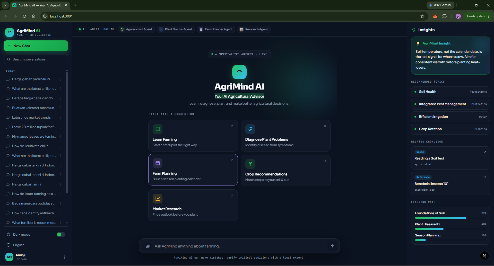

<div align="center">

# 🌱 AgriMind AI

**Your AI-Powered Agricultural Advisor**

*Learn, diagnose, plan, and make smarter agricultural decisions — powered by multi-agent AI.*

[](https://nextjs.org/)
[](https://www.typescriptlang.org/)
[](https://www.prisma.io/)
[](https://www.anthropic.com/)
[](https://tailwindcss.com/)

---

[Features](#-features) · [Architecture](#-architecture) · [Getting Started](#-getting-started) · [Environment Variables](#%EF%B8%8F-environment-variables) · [Folder Structure](#-folder-structure) · [Tech Stack](#-tech-stack) · [License](#-license)

</div>

---

## 📋 Overview

**AgriMind AI** is a full-stack AI agricultural advisory platform built with Next.js. It uses a **multi-agent architecture** where a Supervisor Agent routes user queries to specialized agents — each with domain-specific expertise in areas like crop management, plant pathology, farm planning, and agricultural research.

The system combines **Retrieval-Augmented Generation (RAG)** with a curated agricultural knowledge base, **web search** for real-time information, a **citation system** for source transparency, and a **proactive insight generator** that surfaces recommendations beyond what was explicitly asked.

---

## 🎬 Preview

<div align="center">



*Home view — specialist agents online, suggested workflows, and the proactive insight panel.*

</div>

---

## ✨ Features

### 🤖 Multi-Agent System
| Agent | Role | Specialization |
|-------|------|----------------|
| **Supervisor** | Intent classification & routing | Analyzes queries and routes to the right specialist |
| **Agronomist** | Senior agricultural consultant | Rice, corn, chili, banana, mango, citrus cultivation |
| **Plant Doctor** | Plant pathology specialist | Disease diagnosis, pest identification, nutrient deficiency analysis |
| **Farm Planner** | Cultivation planning | Goal analysis, crop suitability, cost estimation, ROI analysis |
| **Research Agent** | Knowledge retrieval | Evidence-based answers from RAG, government, and university sources |

### 🧠 Intelligent Features
- **RAG Knowledge Base** — Curated agricultural documents for 12 crop/topic categories with vector-based similarity search (pgvector + HNSW)
- **Web Search Integration** — Real-time web search via Tavily API with smart routing (decides when RAG alone isn't enough)
- **Citation System** — Every factual claim is traceable to its source with ranked citations
- **Conversation Memory** — Long-term memory that remembers user's crops, interests, goals, and challenges across sessions
- **Proactive Insights** — AI-generated recommendations, risk alerts, and learning suggestions after each response
- **Confidence Framework** — Transparent confidence scoring (Strong Evidence → Possible → More Info Required)

### 🎨 Premium UI
- Dark-themed interface with glassmorphism design
- Real-time streaming responses with agent status indicators
- Sidebar with conversation history (pinning, archiving, search)
- Right-side insight panel with learning paths
- Collapsible sidebar & insight panel (desktop) — collapse either to a slim icon rail to maximize the chat area; the state is remembered across reloads
- Suggested prompts for new users
- Fully responsive layout

---

## 🏗 Architecture

```
User Query
    │
    ▼
┌──────────────────┐
│  Supervisor Agent │ ← Intent classification + routing
└────────┬─────────┘
         │ routes to
         ▼
┌──────────────────┐    ┌──────────┐    ┌────────────┐
│ Specialist Agent │───▶│  Tools   │───▶│  Response   │
│ (Agronomist /    │    │ • RAG    │    │ • Blocks    │
│  Plant Doctor /  │    │ • Web    │    │ • Citations │
│  Farm Planner /  │    │ • Memory │    │ • Insights  │
│  Researcher)     │    │ • Cite   │    └────────────┘
└──────────────────┘    └──────────┘
```

### AI Principles
- **Single routing layer** — One supervisor, no nested chains
- **Tool-first architecture** — Agents use tools, not free-form generation
- **Retrieval before generation** — Always check knowledge base before generating
- **Consistent output contracts** — Structured JSON responses across all agents

---

## 🚀 Getting Started

### Prerequisites

| Requirement | Version | Purpose |
|-------------|---------|---------|
| **Node.js** | ≥ 18 | Runtime |
| **PostgreSQL** | 16+ with pgvector | Database + vector search |
| **Anthropic API Key** | — | Claude model for AI generation |
| **OpenAI API Key** | — | Text embeddings (RAG) |
| **Tavily API Key** | — | Web search (optional) |

### Installation

```bash
# 1. Clone the repository
git clone https://github.com/aminju14/agri-mind-ai.git
cd agri-mind-ai

# 2. Install dependencies
npm install

# 3. Configure environment variables
cp .env.example .env
# Edit .env with your API keys and database URL

# 4. Set up the database
#    Make sure PostgreSQL is running with pgvector extension
npx prisma migrate dev

# 5. (Optional) Ingest the knowledge base
npm run ingest

# 6. Start the development server
npm run dev
```

The app will be available at **http://localhost:3000**.

### Database Setup

AgriMind requires a PostgreSQL database with the **pgvector** extension for vector similarity search.

```bash
# Using Docker (recommended)
docker run -d \
  --name agrimind-db \
  -e POSTGRES_PASSWORD=postgres \
  -e POSTGRES_DB=agrimind \
  -p 5432:5432 \
  pgvector/pgvector:pg16

# Run migrations
npx prisma migrate dev

# (Optional) Create a restricted app role for RLS
psql -f ops/sql/create-app-role.sql
```

---

## ⚙️ Environment Variables

Copy `.env.example` to `.env` and fill in the required values:

| Variable | Required | Description |
|----------|----------|-------------|
| `DATABASE_URL` | ✅ | PostgreSQL connection string (use non-superuser for RLS) |
| `DIRECT_URL` | ✅ | PostgreSQL admin connection (for Prisma migrations) |
| `ANTHROPIC_API_KEY` | ✅ | Anthropic API key for Claude generation |
| `ANTHROPIC_MODEL` | ❌ | Claude model ID (default: `claude-opus-4-8`) |
| `OPENAI_API_KEY` | ✅* | OpenAI API key for embeddings (*required when RAG is enabled) |
| `OPENAI_EMBED_MODEL` | ❌ | Embedding model (default: `text-embedding-3-large`) |
| `EMBED_DIM` | ❌ | Embedding dimension (default: `1536`) |
| `TAVILY_API_KEY` | ❌ | Tavily API key for web search (gracefully disabled if absent) |
| `AUTH_SECRET` | ❌ | Auth.js v5 secret for session encryption |
| `APP_RATE_LIMIT_PER_MIN` | ❌ | API rate limit per minute (default: `20`) |

---

## 📁 Folder Structure

```
agri-mind-ai/
├── prisma/                     # Database schema & migrations
│   ├── schema.prisma           # Prisma schema (all models)
│   └── migrations/             # Migration history
│
├── public/                     # Static assets
│
├── src/
│   ├── ai/                     # 🧠 AI Core
│   │   ├── agents/             # Specialist agent implementations
│   │   │   ├── base-agent.ts   # Base agent class
│   │   │   ├── agronomist.ts   # Agronomist agent
│   │   │   ├── plant-doctor.ts # Plant Doctor agent
│   │   │   ├── farm-planner.ts # Farm Planner agent
│   │   │   ├── researcher.ts   # Research agent
│   │   │   └── registry.ts     # Agent registry & lookup
│   │   ├── supervisor/         # Supervisor agent (routing brain)
│   │   ├── router/             # Deterministic routing rules
│   │   ├── prompts/            # System prompts for each agent
│   │   ├── contracts/          # Response contracts & types
│   │   ├── citations/          # Citation builder & service
│   │   ├── insights/           # Proactive insight generator
│   │   ├── tools/
│   │   │   └── web-search/     # Tavily web search integration
│   │   ├── llm/                # LLM client abstraction
│   │   ├── routing-service.ts  # Main routing orchestrator
│   │   ├── types.ts            # Shared AI types
│   │   └── index.ts            # Public API barrel export
│   │
│   ├── app/                    # Next.js App Router
│   │   ├── api/                # API routes
│   │   │   ├── chat/           # Chat streaming endpoint
│   │   │   └── conversations/  # Conversation CRUD
│   │   ├── layout.tsx          # Root layout
│   │   ├── page.tsx            # Home page
│   │   └── globals.css         # Global styles
│   │
│   ├── components/             # React UI components
│   │   ├── agrimind-app.tsx    # Main app shell
│   │   ├── chat-thread.tsx     # Chat message thread
│   │   ├── sidebar.tsx         # Conversation sidebar
│   │   ├── insight-panel.tsx   # Right-side insight panel
│   │   ├── citation-cards.tsx  # Citation display cards
│   │   ├── hero.tsx            # Landing hero section
│   │   ├── agent-status.tsx    # Agent routing indicator
│   │   ├── suggested-prompts.tsx # New chat prompt suggestions
│   │   ├── icons.tsx           # SVG icon components
│   │   └── hoverable.tsx       # Hover interaction wrapper
│   │
│   ├── hooks/
│   │   └── use-agrimind.ts     # Main app state hook
│   │
│   ├── lib/                    # Shared utilities
│   │   ├── data.ts             # Data access layer
│   │   ├── chat-stream.ts      # Streaming utilities
│   │   ├── types.ts            # Shared types
│   │   └── utils.ts            # Helper functions
│   │
│   └── server/                 # Server-side services
│       ├── auth/               # Auth.js v5 configuration
│       ├── llm/                # LLM provider integration
│       ├── memory/             # Conversation memory system
│       ├── orchestrator/       # Chat orchestrator
│       ├── persistence/        # Database persistence layer
│       └── rag/                # RAG pipeline (embed, chunk, search)
│
├── knowledge/                  # 📚 Agricultural knowledge base (markdown)
│   ├── rice/                   # Rice cultivation guides
│   ├── corn/                   # Corn cultivation guides
│   ├── chili/                  # Chili cultivation guides
│   ├── banana/                 # Banana cultivation guides
│   ├── mango/                  # Mango cultivation guides
│   ├── citrus/                 # Citrus cultivation guides
│   ├── diseases/               # Plant disease references
│   ├── pests/                  # Pest identification guides
│   ├── fertilization/          # Fertilization techniques
│   ├── irrigation/             # Irrigation methods
│   ├── harvesting/             # Harvesting best practices
│   └── general/                # General agriculture topics
│
├── scripts/                    # Utility scripts
│   ├── ingest-knowledge.ts     # Knowledge base ingestion
│   ├── check-db.ts             # Database health check
│   └── test-tavily.ts          # Tavily API test
│
├── ops/
│   └── sql/
│       └── create-app-role.sql # PostgreSQL RLS app role setup
│
├── docs/                       # 📖 Detailed documentation
│   ├── ARCHITECTURE.md         # Full architecture specification
│   ├── AGENTS.md               # Agent design & behavior
│   ├── DATABASE.md             # Database schema & conventions
│   ├── MASTER_PROMPT.md        # Master prompt specification
│   ├── ROADMAP.md              # Development roadmap
│   └── UI_SYSTEM.md            # UI design system
│
├── .env.example                # Environment template
├── package.json                # Dependencies & scripts
├── tsconfig.json               # TypeScript configuration
├── vitest.config.ts            # Test configuration
└── eslint.config.mjs           # ESLint configuration
```

---

## 🛠 Tech Stack

| Category | Technology |
|----------|------------|
| **Framework** | [Next.js 15](https://nextjs.org/) (App Router) |
| **Language** | [TypeScript 5.7](https://www.typescriptlang.org/) |
| **Styling** | [Tailwind CSS 4](https://tailwindcss.com/) |
| **Fonts** | Sora, Plus Jakarta Sans, JetBrains Mono (Google Fonts) |
| **Database** | [PostgreSQL 16](https://www.postgresql.org/) + [pgvector](https://github.com/pgvector/pgvector) |
| **ORM** | [Prisma 6](https://www.prisma.io/) |
| **AI Generation** | [Anthropic Claude](https://www.anthropic.com/) (claude-opus-4-8) |
| **Embeddings** | [OpenAI](https://openai.com/) (text-embedding-3-large) |
| **Web Search** | [Tavily API](https://tavily.com/) |
| **Testing** | [Vitest](https://vitest.dev/) |
| **Auth** | [Auth.js v5](https://authjs.dev/) |

---

## 📜 Available Scripts

| Command | Description |
|---------|-------------|
| `npm run dev` | Start development server |
| `npm run build` | Build for production |
| `npm run start` | Start production server |
| `npm run lint` | Run ESLint |
| `npm run test` | Run tests with Vitest |
| `npm run test:watch` | Run tests in watch mode |
| `npm run ingest` | Ingest knowledge base documents into the database |

---

## 🧪 Testing

```bash
# Run all tests
npm run test

# Run tests in watch mode
npm run test:watch
```

Tests cover:
- Agent persona validation
- Routing logic (deterministic + supervisor)
- Citation system
- Web search integration
- RAG pipeline
- Memory system
- Insight generator

---

## 📖 Documentation

Detailed documentation is available in the [`docs/`](docs/) directory:

| Document | Description |
|----------|-------------|
| [ARCHITECTURE.md](docs/ARCHITECTURE.md) | Full system architecture specification |
| [AGENTS.md](docs/AGENTS.md) | Agent design, personas, and routing rules |
| [DATABASE.md](docs/DATABASE.md) | Database schema, conventions, and RLS setup |
| [MASTER_PROMPT.md](docs/MASTER_PROMPT.md) | Master prompt and response format specification |
| [ROADMAP.md](docs/ROADMAP.md) | Development roadmap and future features |
| [UI_SYSTEM.md](docs/UI_SYSTEM.md) | UI design system and component guidelines |

---

## 🤝 Contributing

1. Fork the repository
2. Create your feature branch (`git checkout -b feature/amazing-feature`)
3. Commit your changes (`git commit -m 'feat: add amazing feature'`)
4. Push to the branch (`git push origin feature/amazing-feature`)
5. Open a Pull Request

---

## ☕ Support

Jika project ini bermanfaat, kamu bisa mendukung pengembangan AgriMind AI melalui donasi:

<div align="center">

[](https://saweria.co/aminju14)

**[🎁 Donasi via Saweria](https://saweria.co/aminju14)**

</div>

---

## 📝 License

Licensed under the [MIT License](LICENSE) — free to use, modify, and distribute. Attribution appreciated.

---

<div align="center">

**Built with 💚 for the agricultural community**

*AgriMind AI — Practical advice before theory. Evidence before assumptions.*

</div>
